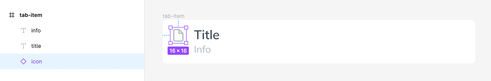
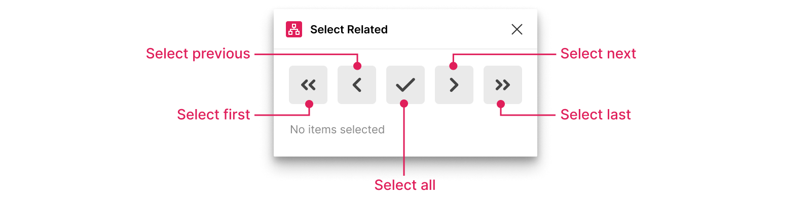

# Figma Select Related

> Select or step through distantly-related items in complex component trees

## Abstract

Let's say you have a UI component with subcomponents `icon`, `title` and `text`:



You use this component in a list, and you want to change the individual icons.

The **Select Related** plugin identifies **related** components (i.e. cousins) based on their **hierarchical position**:


Selecting items this way is useful when:

- you cannot select by similar properties
- you want to contain selection to the closest common ancestor

Note that the algorithm that determines relatedness should work to any depth where related hierarchies have the same **names**, and the related items the same **index** (this may be tweaked in a future release).

## Installation

Check out the plugin's home page here:

- https://www.figma.com/community/plugin/1234204646989309417

Until the plugin is published, you can build the plugin by following the instructions in [Scripts](#scripts).

## Playground

Put the plugin through its paces here:

- https://www.figma.com/file/92mjHSpXeWV4CY2Bfp7GVk/Select-Related-Demo?type=design&t=WdQGemEgHeZnGowh-6

## Usage

### UI

View the Popup via the Plugins menu:

- `Plugins ` > `Select Related` > `Show UI...`

There are 5 buttons which let you quickly select a related item:



Holding `Alt` allows you to move up or down the tree:


### Commands

Some of the UI actions are available as commands via `Cmd`+`/`:

- `Select Related` > `All`
- `Select Related` > `Next`
- `Select Related` > `Prev`
- `Select Related` > `Show UI...`

This lets you quickly select items or repeat the last command.

## Development

### Scripts

The following scripts are available:

```bash
# develop
npm run dev

# build
npm run build
```

### Files

Edit the `ui.svelte` and `plugin.ts` files.

Currently, the UI is built using Svelte, but this may change to Alpine.

### Figma

In the Figma UI choose:

- `Plugins` > `Development` > `Import plugin from manifest`

Find the built plugin in the `dist` folder and choose the `manifest.json` file.

The plugin should pop up in the Figma UI Plugins panel.
